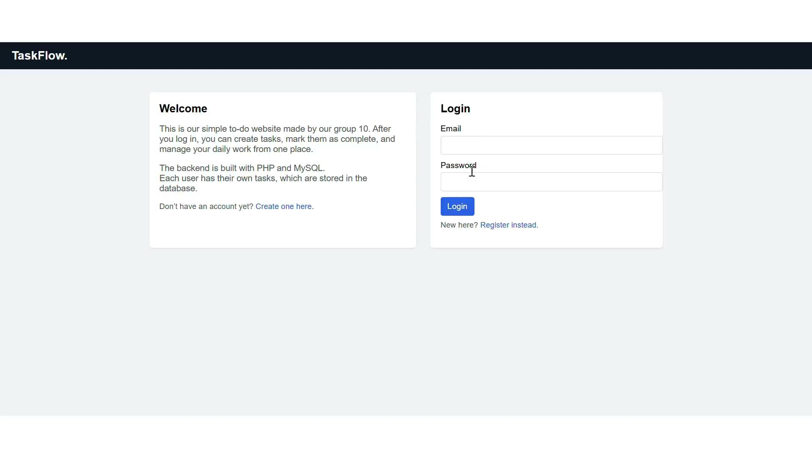
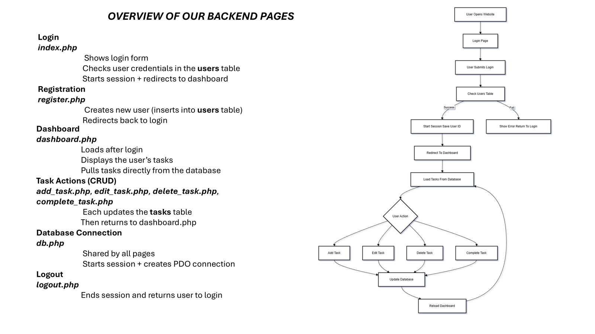
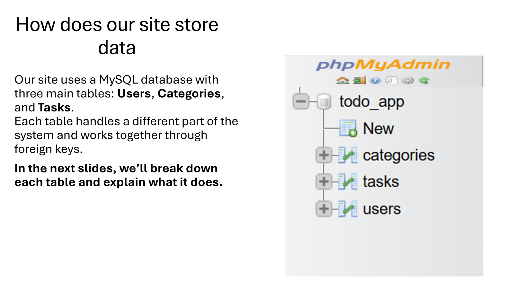
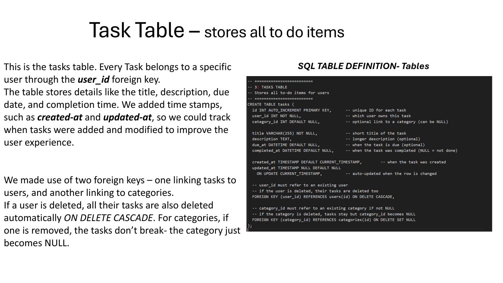

# TaskFlow Task Management System

A PHP and MySQL task-management web application built for local use with XAMPP. TaskFlow lets users register, log in, manage their own tasks, mark tasks complete, undo completion, edit task details, and delete tasks from a simple dashboard.

## Recruiter Summary

TaskFlow is a full-stack PHP/MySQL CRUD application with user authentication, session-based access control, PDO database queries, and user-specific task management. It demonstrates practical backend workflow, database design, secure password hashing, and a clean project structure suitable for local deployment with XAMPP.

## Problem Statement

Many students and small teams need a simple way to track daily tasks without using a large project-management platform. This project solves that problem by providing a lightweight web app where each user can create an account and manage only their own tasks.

## Features

- User registration with basic validation.
- Secure password hashing with PHP `password_hash()`.
- User login with `password_verify()`.
- Session-based authentication.
- Logout flow that clears the active session.
- User-specific task dashboard.
- Create, read, update, delete task workflow.
- Mark tasks as complete and undo completion.
- Optional task description, category ID, and due date fields supported by the task model.
- Centralized database connection through `src/db.php`.
- PDO prepared statements for database access.

## Technologies Used

- PHP
- MySQL
- PDO
- HTML
- CSS
- XAMPP
- Apache
- phpMyAdmin

## Project Structure

```text
Task-Management-System/
|-- README.md
|-- src/
|   |-- index.php
|   |-- register.php
|   |-- dashboard.php
|   |-- add_task.php
|   |-- edit_task.php
|   |-- delete_task.php
|   |-- complete_task.php
|   |-- logout.php
|   |-- db.php
|   `-- db_test.php
|-- assets/
|   |-- css/
|   |-- images/
|   `-- js/
|-- screenshots/
|-- docs/
|-- sql/
|   |-- schema.sql
|   `-- sqltable.txt
```

## System Architecture

TaskFlow uses a traditional server-rendered PHP architecture:

1. The browser sends requests to PHP pages in `src/`.
2. Pages that need database access include `src/db.php`.
3. `src/db.php` starts the PHP session and creates the PDO MySQL connection.
4. Authentication data is stored in `$_SESSION`.
5. Task pages use the logged-in user's session ID to load or modify only that user's tasks.
6. MySQL stores users, categories, and tasks.

## Database Structure

The app expects a MySQL database named `todo_app`.

Main tables:

- `users`: stores account details and hashed passwords.
- `categories`: stores optional task categories such as school, work, or personal.
- `tasks`: stores user tasks, descriptions, category links, due dates, completion timestamps, and creation timestamps.

The import file is available at:

```text
sql/schema.sql
```

## Backend Workflow

- `src/db.php` starts the session and creates the PDO connection.
- `src/index.php` handles login and redirects authenticated users to the dashboard.
- `src/register.php` validates registration input, hashes the password, and inserts a new user.
- `src/dashboard.php` checks the active session and loads tasks for the current user.
- `src/add_task.php` inserts a new task for the logged-in user.
- `src/edit_task.php` loads an existing task, checks ownership, and updates it.
- `src/complete_task.php` sets or clears the completion timestamp.
- `src/delete_task.php` deletes a task only when it belongs to the logged-in user.
- `src/logout.php` clears the session and returns the user to login.

## Authentication Flow

1. A new user registers with username, email, password, and password confirmation.
2. The password is hashed before being saved to the `users` table.
3. During login, the submitted email is used to find the user record.
4. `password_verify()` checks the submitted password against the saved hash.
5. On successful login, the app stores the user's ID, username, and email in the session.
6. Protected pages redirect unauthenticated users back to `src/index.php`.
7. Logout clears and destroys the session.

## CRUD Functionality

| Operation | File | Description |
| --- | --- | --- |
| Create | `src/add_task.php` | Adds a task for the logged-in user. |
| Read | `src/dashboard.php` | Displays all tasks owned by the current user. |
| Update | `src/edit_task.php` | Updates task title, description, category, and due date. |
| Complete/Undo | `src/complete_task.php` | Marks a task complete or restores it to incomplete. |
| Delete | `src/delete_task.php` | Deletes a task owned by the current user. |

## Preview

### Login Page



### Backend Page Flow



### Database Overview



### Task Table



## Setup Instructions

### 1. Install XAMPP

Download and install XAMPP for your operating system.

### 2. Start Apache and MySQL

Open the XAMPP Control Panel and start:

- Apache
- MySQL

### 3. Place the Project in `htdocs`

Copy or clone this repository into the XAMPP `htdocs` folder.

Example folder path:

```text
C:\xampp\htdocs\Task-Management-System
```

### 4. Import the SQL Database

1. Open phpMyAdmin at `http://localhost/phpmyadmin`.
2. Create a database named `todo_app`.
3. Select the `todo_app` database.
4. Open the Import tab.
5. Choose `sql/schema.sql`.
6. Click Import.

### 5. Confirm Database Settings

The default database connection in `src/db.php` is:

```php
$DB_HOST = '127.0.0.1';
$DB_NAME = 'todo_app';
$DB_USER = 'root';
$DB_PASS = '';
```

These settings match the default local XAMPP MySQL setup.

### 6. Open the Localhost URL

Visit:

```text
http://localhost/Task-Management-System/src/index.php
```

## Challenges Encountered

- Keeping user sessions consistent across multiple PHP pages.
- Making sure users can only view, update, complete, or delete their own tasks.
- Centralizing the database connection so every page uses the same PDO setup.
- Designing table relationships between users, tasks, and optional categories.
- Separating completed and incomplete task state using timestamps.

## Future Improvements

- Improve the visual design with a shared stylesheet.
- Add search and filtering for tasks.
- Add priority levels for tasks.
- Expand category management beyond fixed category IDs.
- Add password reset and email verification.
- Improve form feedback for validation errors.
- Add automated tests for authentication and task workflows.

## What I Learned

- How to connect PHP to MySQL using PDO.
- How to use prepared statements for safer database queries.
- How PHP sessions protect authenticated pages.
- How to hash and verify passwords correctly.
- How CRUD operations map to separate backend workflows.
- How to structure a small full-stack project for clearer presentation.

## Project Documents

- [Project presentation PDF](docs/project-presentation.pdf)
- [Project presentation PPTX](docs/project-presentation.pptx)
